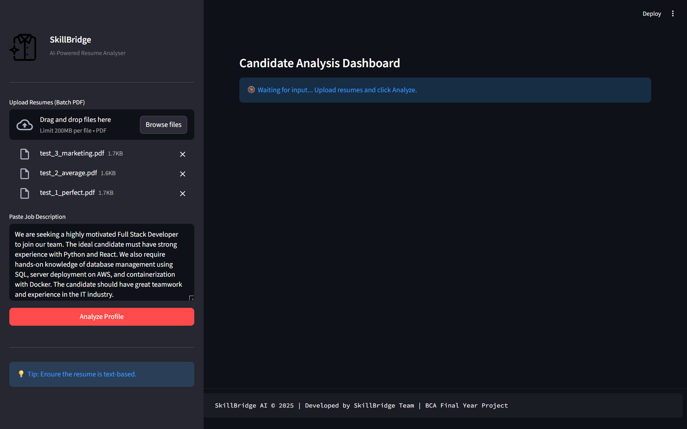
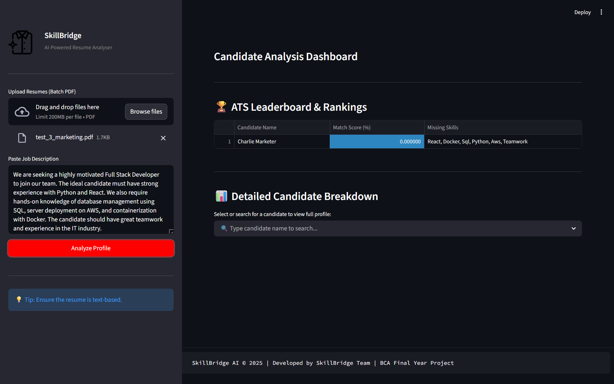
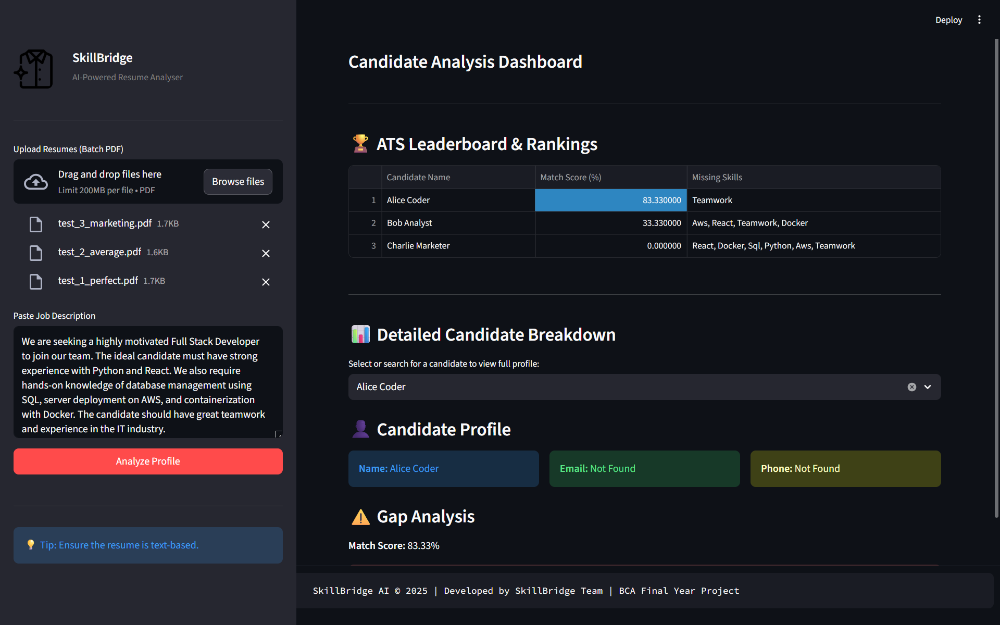

# 🚀 SkillBridge: AI-Powered Resume Gap Analyzer


**SkillBridge** is an intelligent career-tech tool designed to bridge the gap between job seekers and industry requirements[cite: 1]. By leveraging a **Hybrid NLP Engine**, it goes beyond simple keyword matching to provide deep semantic analysis and actionable feedback for resume optimization[cite: 1].
---

## 🌟 Key Features

* **📊 Smart Scoring System:** accurately calculates a 0-100% match score using Jaccard Similarity and Weighted set operations.
* **🧠 Hybrid AI Logic:** Combines a strict **Database of 500+ Tech Keywords** with **Spacy NLP** to detect dynamic skills (like "SEO" or "Marketing") automatically.
* **🔍 Categorized Gap Analysis:** Doesn't just list missing words; classifies them into **Technical Skills**, **Soft Skills**, and **Tools**.
* **🚫 Smart Filtering:** Includes a robust "Blacklist" to ignore generic buzzwords (e.g., "Experience", "Candidate") for higher accuracy.
* **⚡ Modern UI:** Built with **Streamlit** featuring Dark Mode, Interactive Donut Charts (Plotly), and a responsive sidebar layout.

---

## 🛠️ Tech Stack

* **Frontend:** Streamlit (Python Web Framework)
* **Natural Language Processing:** Spacy (`en_core_web_sm`), Scikit-Learn
* **PDF Parsing:** PDFMiner.six (Robust text extraction)
* **Visualization:** Plotly (Interactive Gauges & Charts)

---

## ⚙️ How It Works (The Logic)

1.  **Extraction:** The app extracts raw text from the uploaded PDF resume using `pdfminer`.
2.  **Cleaning:** It removes special characters, emails, and phone numbers to reduce noise.
3.  **Hybrid Parsing:**
    * *Phase 1:* Checks against a curated database of IT/Tech skills (Python, SQL, AWS, etc.).
    * *Phase 2:* Uses NLP (Named Entity Recognition) to find "Proper Nouns" (capitalized skills) that are not in the database, allowing it to adapt to non-tech roles (like Marketing or Management).
4.  **Analysis:** Compares the Resume skills vs. JD requirements using Set Theory (Intersection/Union) to calculate the score and identify gaps.

---

## 🚀 Installation & Setup

1.  **Clone the Repository**
    ```bash
    git clone [https://github.com/your-username/SkillBridge.git](https://github.com/your-username/SkillBridge.git)
    cd SkillBridge
    ```

2.  **Install Dependencies**
    ```bash
    pip install -r requirements.txt
    ```

3.  **Run the App**
    ```bash
    streamlit run main.py
    ```

---

## 📸 Screenshots




---

### 👨‍💻 Author
Developed by **[Anuj Sukenkar & Team]**

*BCA Final Year Project*
